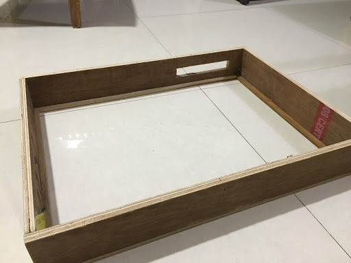
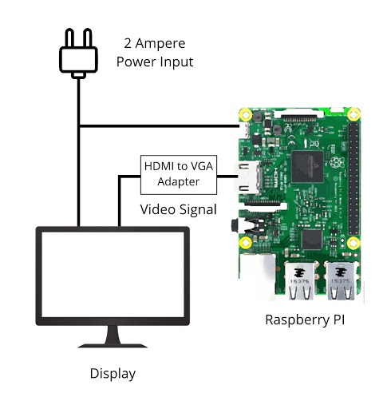

# Smart Mirror

### Abstract

A mirror is a thing in front of which you stand several times a day. Every time you look into the mirror, It shows your physical image. What if the mirror shows more than your physical image. A smart mirror shows you more of you. It shows your calendar, to-do list, weather conditions, news headlines, date, and time. It shows you a “Thought of The Day”. For all the information a person looks in their smartphone for daily routine are now available in a smart mirror while you are performing daily tasks. It saves times and effort in getting such information. Interaction is now more user-friendly and input-less.

### What is smart mirror

A Smart Mirror is a two-way mirror with a screen behind the glass. The display can show the user various kind of information like the weather forecast, temperature, time and other useful information in the form of widgets. This product will be useful for busy individuals that want to multitask and stay informed while on the go. Instead of constantly pulling out a device. One can get informed while finishing daily grooming tasks.

### Features

As the mirror helps to see yourself physically. The smart mirror will help to show the image of your agenda of the day. While looking at the mirror it also shows you

1. Your Calender
2. To-do list
3. Time and Date
4. Top Headlines
5. Weather Conditon
6. Personal Quote

### Component Used

1. Frame -  Frame is the wooden enclosure for the mirror and electrical component. The volume of this wooden frame will be enough to contain a mirror, screen, Raspberry Pi and other connections.

   

2. **Mirror** - Mirror will be a two-way mirror which has a property of being reflective in one side and transparent on the other side.

   

3. **Screen** - A computer monitor of 15-inch screen size (diagonally) is used for the display.

   

4. **Controller** - Raspberry PI 3 model B+ is used here as a controller. It runs the software for the smart mirror.

   

### Design

- Framework Design - The basic design starts with a frame which will hold the mirror and the screen behind the mirror. Two-way glass works in a way that it allows the light from the screen to pass through the mirror, But the light coming from the outside of the frame gets reflected and act as a mirror. In the application, the text color will be white and the background color will be black so that only the text will be visible on the mirror and other areas will act like a normal mirror.

  

- Electrical Design - Raspberry PI and display is connected to 2 Ampere power source.The display takes input from raspberry PI through a VGA cable. An adapter is used here to connect HDMI port to VGA port. The power source can be 220 Volt AC (Normal house power supply).

  

- Network Design - The mobile is connected to the internet and the application uploads personalize data to the server. The smart mirror is connected to the internet via wifi or ethernet cable. The mirror fetches the data from the server and display on the screen. It requires a steady internet connection to fetch weather condition, news, and personal details of the user. 

  

- Database Design

  

### Implementation

1. Mobile App

   Mobile app for the smart mirror is used to control the preferences of the user.If the user is not logged in, User can proceed to:- 

   - Login with username and password
   - Recover password with the email
   - Sign up for a new account

   If the user is logged in, User will have the following controls:-

   - A switch to change the temperature unit. (Celsius or Ferenhite)
   - A switch to change time format.(12 hour or 24 hour)
   - A switch to enable/disable news feed on the mirror.
   - A switch to enable/disable calendar on the mirror.
   - A section to set a custom quote
   - A button to get “Thought of the Day”
   - A to-do list section to add tasks.
   - A settings section
     - To change password
     - To link mirror
     - To Sign out

   The mobile app is built using the following tools and language :

   - Xcode 10.1
   - Swift 4.2

   For extending the functionalities of the application, the following APIs were used

   - Firebase iOS API: for database connectivity
   - Realm: To store data locally on phone.
   - SVProgressHUD: For animating activity indicator
   - TextFeildEffect: for animating text fields.

   

   ### Screenshots of Mobile App

   

   

   

   

2. Web Application on Raspberry Pi

   The web application is build using HTML CSS and Javascript.

### Conclusion

Smart mirror can be installed in the room. It will display the following information:

- Date and time
- Weather Condition
- News headlines
- To-do list
- Custom quote
- Calendar events

Having the above-listed information on the mirror will be advantageous for:

- Some people have a busy schedule, so while they stand in front of the mirror they will get all the important information while performing daily grooming activity.
- Some people have a lack of motivation when they wake up. By setting a motivational quote on the mirror will help them to boost their confidence and give them the energy to start the day efficiently.
- People often forgot about important events which they regret later. The mirror will show calendar events.
- Weather conditions are not predictable by humans, Smart mirror will help the user to decide whether to take umbrella or not.
- Every day we have tasks to do. It is not always possible to remember every task. The smart mirror will keep showing you important tasks to do.
- In a busy schedule, It is not always possible to be aware of what is happening around you. The smart mirror will show you news headlines on the mirror. 
- Sometimes condition arises where you want to leave a short message to the other person who will come later to the room when you will not be present. The user can change the quote to a short message that will be always until changed.
- As time and date will be shown in the mirror always. The smart mirror is a replacement of clock and calendar of your room.
- Personalization is easy, Through the mobile app, the user can change temperature unit, time format, custom quote, todo list, and calendar. Every time the user changes the preferences or data, The changes are made immediately.

